<div align="center">

<!-- header badges -->


[](https://github.com/Illuminoxx)

</div>

---

## 🧠 about me

CS student at the intersection of **machine learning** and **backend engineering**.
I build and ship real systems — not just notebooks. Currently deployed a dual-model FinBERT + Random Forest pipeline for stock movement prediction on HuggingFace Spaces. ICPC-style competitive programmer, Flask/Node.js backend dev, and ML practitioner with hands-on deployment experience.

> **Interested in →** Backend Dev · AI/ML Engineering · System Design · MLOps

---

## ⚡ tech stack

```
Languages   →  C++  Python
Frameworks  →  Flask  Node.js
ML / AI     →  FinBERT  scikit-learn  HuggingFace  PRAW  yFinance
Tools       →  Git  GitHub  Linux
```

[](https://github.com/Illuminoxx)

---

## 🏆 competitive programming

| metric | value |
|--------|-------|
| Problems Solved | 250+ |
| Global Rank | Top 19% |
| Style | ICPC / Contest |

[](https://leetcode.com/Illuminoxx)

---

## 📊 github stats

<div align="center">


[](https://git.io/streak-stats)

[](https://github.com/Illuminoxx)

</div>

---

## 🚀 featured project

### SentimentEdge — Stock Predictor via Tweet Sentiment

> Dual-model ML pipeline · FinBERT + Random Forest · Flask API · HuggingFace Spaces

```diff
+ FinBERT sentiment scoring on financial tweets
+ Random Forest classifier for next-day movement prediction
+ Real-time tweet ingestion via PRAW
+ Flask REST backend + vanilla JS frontend
+ Deployed live on HuggingFace Spaces
~ Stack: Python · Flask · scikit-learn · yFinance · PRAW
```


🌐 [Live Demo](https://huggingface.co/spaces/vectorxx/sentiment) &nbsp;|&nbsp; 📂 [Source Code](https://github.com/Illuminoxx/QuantMirror)

---

## 📈 contribution activity

[](https://github.com/Illuminoxx)

---

## 🔗 connect

[](https://www.linkedin.com/in/prashantzx)
[](mailto:prashant11ujjain@gmail.com)
[](https://github.com/Illuminoxx)
[](https://leetcode.com/Illuminoxx)

<div align="center">


</div>
