<p align="center">
  
</p>

---
## 🧠 about me

💠 CS student at the intersection of **machine learning** and **backend engineering**.

**🎓 NIT Patna**
B.Tech · Computer Science & Engineering · 


⚙️ Currently deployed a dual-model FinBERT + Random Forest pipeline for stock movement prediction on HuggingFace Spaces.

📝 A regular competitive programmer at leetcode  & codeforces 

🔧 Flask/Node.js backend dev, and ML practitioner with hands-on deployment experience.


> 🧿 interested in Backend Dev · AI/ML Engineering · System Design 


---


## ⚡ tech stack

```
Languages   →  C++ · java · Python · HTML+CSS · Jscript · react
Frameworks  →  Flask · Node.js
AI / ML    →   FinBERT · scikit-learn ·  HuggingFace  
Tools       →  Git ·  GitHub · WEKA  ·  MySQL-workbench · Lex 
```

[](https://github.com/Illuminoxx)

---

## 🏆 programming

| metric                     |                           value |
|----------------------------|---------------------------------|
| DSA Problems Solved        |                            400+ |
| Global Rank on leetcode    |                          Top 19% |


---

## 📊 github stats

<div align="center">


[](https://git.io/streak-stats)

</div>

---

## 🚀 featured project

### DebugAgent — Autonomous AI Debugging System
**Agentic AI Workflow · LangGraph · FastAPI · React · Hugging Face Spaces**

```diff
+ Autonomous multi-agent debugging with iterative self-correction (up to 5 retries)
+ Sandbox code execution to validate fixes before presenting results
+ Real-time SSE streaming of analysis, patching, execution, and review
+ AI-generated code review with confidence scoring and bug categorization
+ Persistent debug session history with searchable conversations
~ **Stack:** LangGraph · FastAPI · React · Groq Llama 3.3 · SQLite · Hugging Face Spaces · Vercel
```
+ 🌐 [Live Demo](https://debugpilot-nine.vercel.app/) 
+ 📂 [Source Code](https://github.com/Illuminoxx/debugpilot.git)

---

### SentimentEdge — Stock Predictor via Tweet Sentiment

> Dual-model ML pipeline · FinBERT + Random Forest · Flask API · HuggingFace Spaces

```diff
+ FinBERT sentiment scoring on financial tweets
+ Random Forest classifier for next-day movement prediction
+ Real-time tweet ingestion via PRAW
+ Flask REST backend + vanilla JS frontend
+ Deployed live on HuggingFace Spaces
~ Stack: Python · Flask · scikit-learn · yahoo-Finance 
```


+ 🌐 [Live Demo](https://vectorxx-sentiment.hf.space) 
+ 📂 [Source Code](https://github.com/Illuminoxx/QuantMirror.git)

---

## 📈 contribution activity

[](https://github.com/Illuminoxx)


🟡 **Deployment-enviornment** — HF Spaces · Git

---

## 🔗 connect

[](https://www.linkedin.com/in/prashantzx)
[](mailto:prashant11ujjain@gmail.com)
[](https://github.com/Illuminoxx)


</td>
</tr>
</table>

> 📩 Available for internships & full-time roles · prashant11ujjain@gmail.com

---
